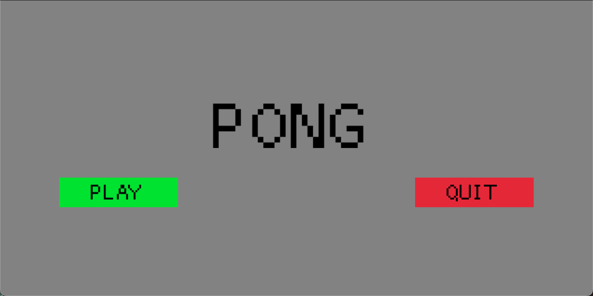
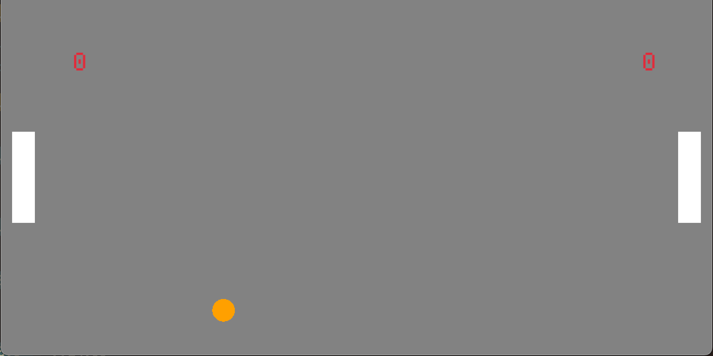
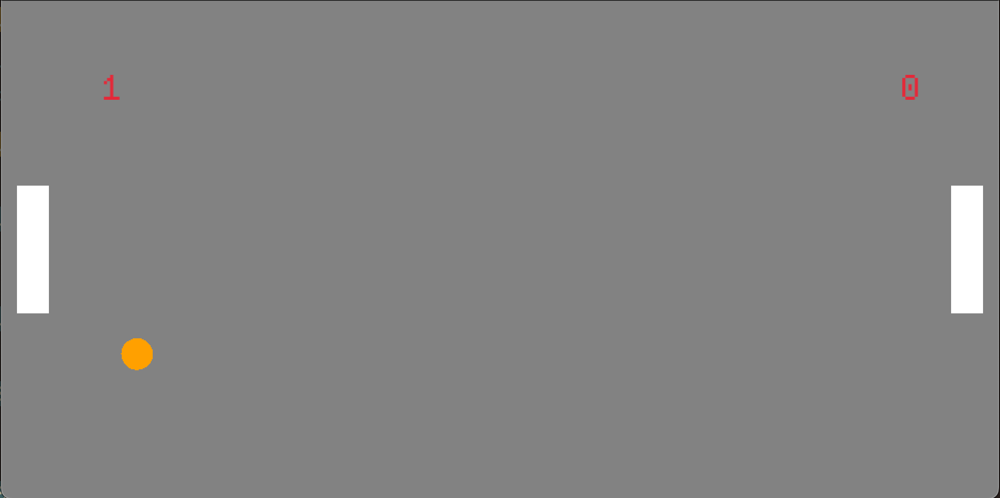
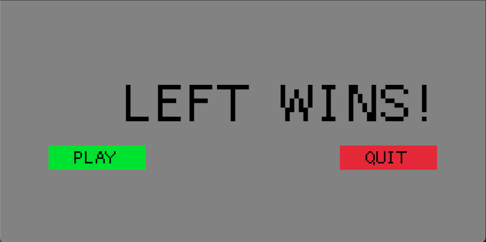

# Macroquad Pong Game

This an implementation of the classic atari pong game, complete with a start,
game and end screen.

## Mechanics

### Controls

- To start the game (or end it), use the mouse to click either of the buttons.

- The player on the left controls their paddle using `W` to move up, and `S` to
  move down.

- The player on the right controls their paddle using the `up arrow` to move up,
  and the `down arrow` to move down.

- Once either player has won the game, the screen will switch to a end screen and
  display the winner of the game, along with buttons to play again, or quit.

### Score

- If the ball manages to get past the paddle on either players side the opposing
  players score will go up.

- A player will win once their score reaches three.

### Ball Respawn

- After a player scores the screen will switch to a countdown timer (from three to
  zero) and will reset the ball to the centre of the screen and the paddles to their
  original position.

## Photos

### Start Screen

### Count Down Screen

### Game Screen

### Player Scored

### Winner Screen

